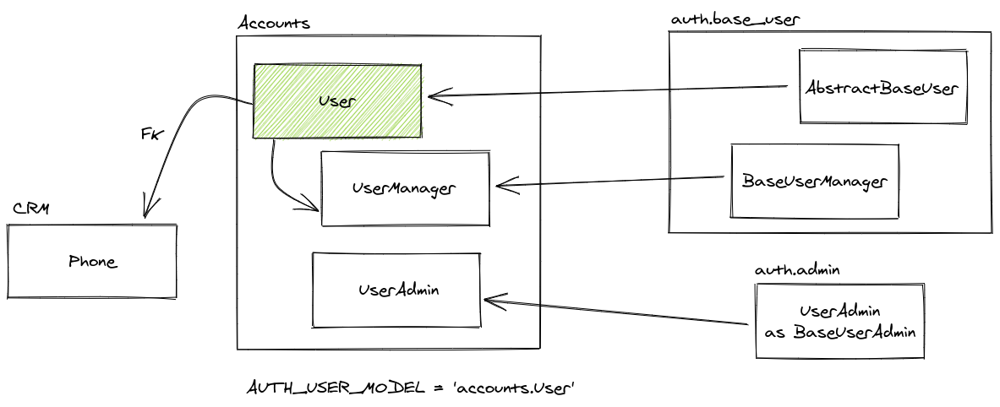
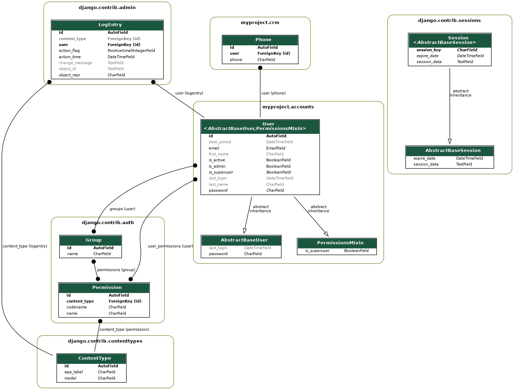

# django-custom-login-email

Django custom login email tutorial.

## This project was done with:

* [Python 3.8.9](https://www.python.org/)
* [Django 3.1.8](https://www.djangoproject.com/)

## How to run project?

* Clone this repository.
* Create virtualenv with Python 3.
* Active the virtualenv.
* Install dependences.
* Run the migrations.

```
git clone https://github.com/rg3915/django-custom-login-email.git
cd django-custom-login-email
python -m venv .venv
source .venv/bin/activate
pip install -r requirements.txt
python contrib/env_gen.py
python manage.py migrate
python manage.py createsuperuser --email='admin@email.com'
```

## Este projeto foi feito com:

* [Python 3.8.9](https://www.python.org/)
* [Django 3.1.8](https://www.djangoproject.com/)

## Como rodar o projeto?

* Clone esse repositório.
* Crie um virtualenv com Python 3.
* Ative o virtualenv.
* Instale as dependências.
* Rode as migrações.

```
git clone https://github.com/rg3915/django-custom-login-email.git
cd django-custom-login-email
python3 -m venv .venv
source .venv/bin/activate
pip install -r requirements.txt
python contrib/env_gen.py
python manage.py migrate
python manage.py createsuperuser --email='admin@email.com'
```

## Accounts



## Models



## Links

https://simpleisbetterthancomplex.com/tutorial/2016/07/22/how-to-extend-django-user-model.html#abstractbaseuser

https://docs.djangoproject.com/en/2.2/topics/auth/customizing/#specifying-a-custom-user-model

https://docs.djangoproject.com/en/3.2/topics/auth/customizing/#custom-users-admin-full-example

https://github.com/django/django/blob/main/django/contrib/auth/models.py#L321

https://github.com/django/django/blob/main/django/contrib/auth/base_user.py#L47

